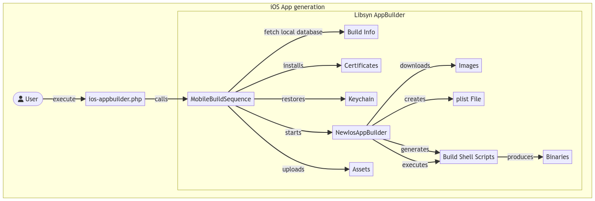
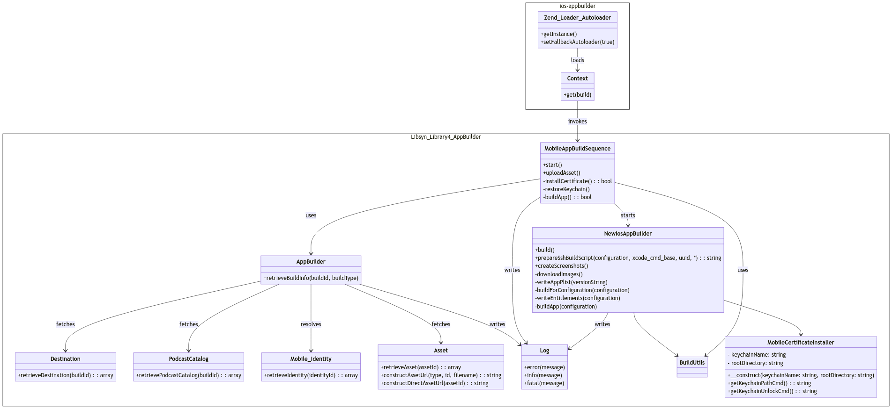
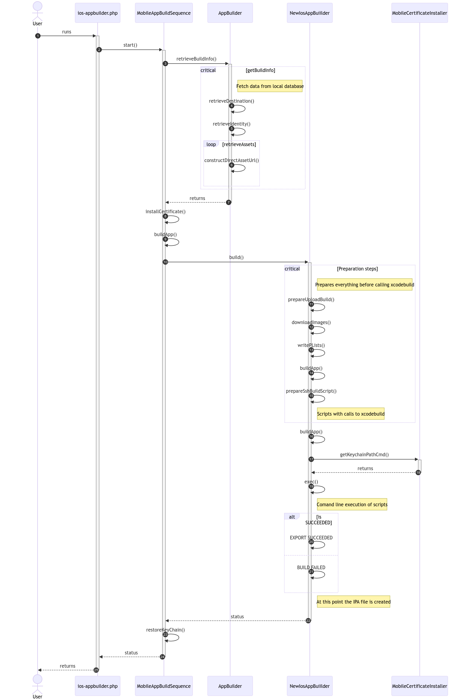

#### Note
**28/5/2024:**
- This README file was created while the iOS builder system was under maintenance, information for Android Windows releases and other scripts should be included when possible. 
- This is an iOS focused documentation, focusing on ios-appbuilder and ios-catalogbuiler but it should include everything in the scripts inside of app-builds folder
- Documentation should be modified to explain every script instead of just ios situations

## Table of Contents
- [Overview](#overview)
- [Installation and Setup](#installation-and-setup)
- [Development](#development)
- [Roadmap](#roadmap)

# iOS App Builder Script (ios-appbuilder.php)

## Overview




This script allows the execution of an App Builder to obtain an iOS application ready for distribution via App Store Connect.

The App Builder is a system created in PHP that has different modules and allows the creation of a Podcast App or a Podcast Catalog App customized for each podcaster according to their requirements.

In particular, this script runs the App Builder with specific client parameters and a version to generate an IPA (iOS App Store package) binary with Release configuration, ready to be distributed to App Store Connect via a tool called Transporter.


## Installation and Setup

### Prerequisites
- PHP 5.6.0
- MySQL 5.7.22
- SSH (seems to be not used, I didn't see where while inspecting the project @Andres Vidal)
- Zend Engine 2.6.0 with Zend OPCache v7.0.6-dev
- Apache/2.4.58 (Unix) installed and running as local user to intall certificates properly
- Git 2.39.3 (Apple Git-145)
#### iOS
- macOS Ventura 13.6.7
- Xcode 15.0
- Xcode 15.0 Command Line Tools for manual iOS builds
- Xcode's iOS 17.0 Simulator
- Transporter 1.3 for App Store Connect uploads
#### Android
TBD
#### Windows
TBD

### Installation 
1. TBD

## Usage
### Manual Operation
1. Access the Kernel-based virtual machine on the Mac Mini.
2. Open Terminal app
3. Go to the App builds scripts directory
 ```sh
   cd /Users/libsyn/Sites/libsyn/scripts/app-builds
   ```
4. Run the script indicating podcaster ID (dest_id), temporary_build and version
 ```sh
   php ios-appbuilder.php 12030 0 2.5.138
   ```
5. Open another Terminal tab or window if you prefer and go to the proper log

- In this example we are going to the 2024's May 24th day log 
 ```sh
   cd /Users/libsyn/Sites/logs/
   cd 2024 # the current year
   cd 05 # current month zero padded
   cd 23 # current day zero padded 
   ```
- Then run tail to keep looking for the combile log to see for errors 
 ```sh
  tail -f combined.log
  ```
6. Monitor the Log: keep watching the project log for important key moments
  - **Building Signed**: Pay attention when the project says **BUILDING SIGNED**, it's the beginning of the production ready binary creation. 
  - **Archive Succeeded**: Stay alert for when it says **ARCHIVE SUCCEEDED**, meaning the process was sucessful. 
  - **Export Succeeded**: A few lines below, right before the line that says **EXPORT SUCCEEDED**, you should see and copy the path:
  ```sh
  Exported podcastappNoWatch to: [path/to/the/.ipa file directory] # e.g. /Users/libsyn/Sites/build/builds/edgefm839/Release
  ```
7. Go back to any Terminal tab or window and open the directory

- Open the folder in Finder by calling the command `open`
   ```sh
   open [path/to/the/.ipa file directory] # e.g /Users/libsyn/Sites/build/builds/edgefm839/Release
   ```
- Finder will open a window with all the files, an ipa file among these.
8. Open Transporter and then Drag & Drop the ipa file to finish the process.

## Builder Internals

### General Class Diagram



The Builder System internally performs tasks akin to those handled by Xcode, using xcodebuild for iOS builds. It creates necessary files like InfoPlist and assets for the iOS project before generating the binary. Similar processes are implemented for Android and Windows builds.

The system comprises several components, these are the 3 most important:
1. **iOS App Builder (ios-appbuilder.php):**  The main component, sets execution parameters, accepts input via $_GET or command-line arguments, manages a lock file to prevent concurrent builds, initiates the build sequence (`MobileAppBuildSequence`), handles errors, and provides JSON output if specified. Additionally, it logs errors and build status for record-keeping.
2. **MobileAppBuildSequence.php (Library4/Libsyn/AppBuilder):** This class serves as the conductor of the mobile app building process, ensuring the retrieval of build information of the specific Podcaster from the local database within the KVM environment, then fetching custom assets from both web services and the web. Seamlessly integrating these processes, it ensures that all necessary components are in place ready prior to call the `NewiOSAppBuilder`
3. **NewIosAppBuilder.php (Library4/Libsyn/AppBuilder):** This class serves as the backbone for iOS app construction, adeptly managing critical aspects of the build process. It handles environment setup, certificate management, and the creation of .plist files tailored to project specifications. A pivotal feature is its execution of a meticulously crafted script, seamlessly integrating various commands to clean, build, and archive the project using xcodebuild. This class ensures precise orchestration of the build pipeline, guaranteeing the generation of polished and deployable iOS applications.

### Main App Generation Sequence Diagram




### Outputs

Everything listed here resides on the KVM Mac Mini where the builder exists: 

* `/Users/libsyn/temp/builder.lock`: Temporal lock file while building, if error, or interrupt action is needed, remember to remove this file prior to run the builder script
* `/Users/libsyn/temp/sshBuildCmd.sh`: The script used by NewIosAppBuilder to build the iOS App
* `/Users/libsyn/temp/exportOptions.plist`: Base plist file to use prior to build
* `/Users/libsyn/Sites/logs/YYYY/MM/DD`: Where several logs resides related to the current day building status, replace YYYY with current year, MM and DD, replaced with zero padded month and zero padded day.
* `/Users/libsyn/Sites/logs/YYYY/MM/DD/combined.log`: Is the most important log to monitor about building status
* `/Users/libsyn/Sites/build/builds/`: The folder in which binaries resides by client identifier

## Delivery Process
1. For iOS, once the IPA files are ready, manually upload the apps to App Store Connect using Transporter.
2. Follow similar delivery procedures for Android and Windows binaries as per their respective requirements.

## CHANGELOG
### Version X

Below is the roadmap of planned features, with the current implementation status:

## Recomendations
### Builder

- [ ] Modify the NewIosAppBuilder to include a functionality to remove DerivedData properly
- [ ] Review why /Library is called in the ios-appbuilder.php file, Library doesn't exist under Libsyn root. Just Library4 and Library5
- [ ] Review why ios-appbuilder.php needs BUILDS for AUTO and UNSIGNED. Removing then, will make the process quicker
- [ ] Try to catch killing the process to remove the lock file
- [ ] Add new parameters to the script to force remove the lock file instead of manually removing it
- [ ] Resolve all PHP notices and warning to clear the log being thrown in STDOUT instead of logs.
- [ ] Some of the INFO and ERROR logs seems more like TRACE or DEBUG level. Plan to modify those to clear the info and errors log. 
- [ ] Refactor writeAppPlist in NewIosAppBuilder to use a template and just modifying specifics items.

### iOS

- [ ] Research moving the build folder used for intermediate buildings to another place than the Xcode project itself, or
- [ ] When cleaning the build folder on Xcode, the projects fails to clean. Research why the "xattr" command used when the builder is run manually is not behaving as expected. Xcode when cleaning throws and error regarding the existence of the build folder inside the project but created from an external system. 


## Contributors
- Andres Vidal ([andresvidal@gmail.com] Moonshot Partners)